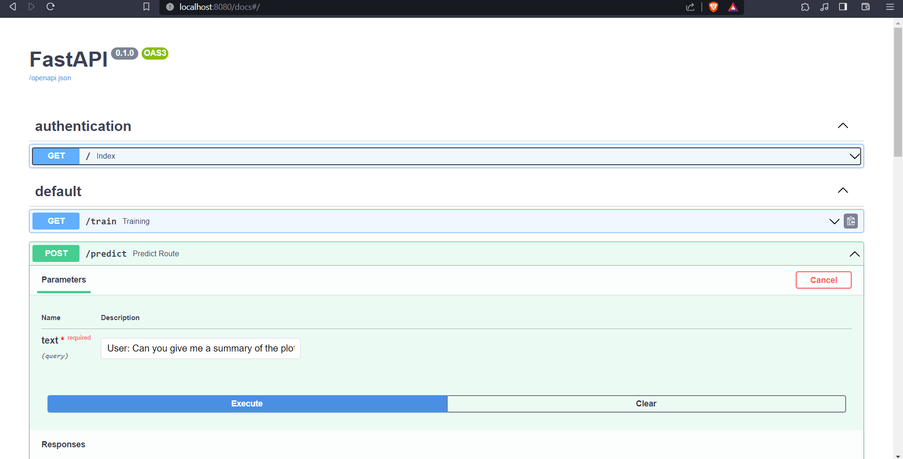
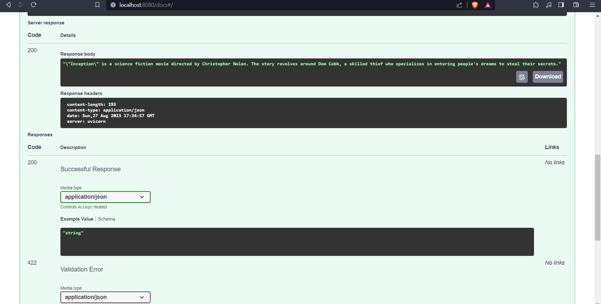

# Text-Summarizer-Project
## Project Overview
The Text Summarizer project utilizes the T5-Small model, a variant of the Text-To-Text Transfer Transformer (T5) developed by Google, to automatically generate concise and coherent summaries of longer pieces of text. This project aims to improve the accessibility of information by condensing lengthy documents into succinct summaries, enabling users to quickly grasp the main points without having to go through the entire text.

## Model Choice: T5-Small
The T5-Small model is a pre-trained transformer-based language model that excels in text-to-text tasks. It can be fine-tuned for specific applications, such as text summarization. This model has proven effective in generating high-quality summaries, as it is capable of understanding the contextual nuances of the input text and generating coherent and relevant summaries.


# How to run?
### STEPS:

Clone the repository

```bash
https://github.com/naman-pasari/Text-Summarizer
```
### STEP 01- Create a conda environment after opening the repository

```bash
conda create -n venv python=3.8 -y
```

```bash
conda activate venv/
```


### STEP 02- install the requirements
```bash
pip install -r requirements.txt
```

### STEP 03- install the requirements for GPU acceleration (optional)
```bash
# Considering that current CUDA version compatible at time
# of building this repo with Pytorch is 11.8
conda install cudatoolkit=11.8
conda install cudnn = 8.9.2
conda install pytorch torchvision torchaudio pytorch-cuda=11.8 -c pytorch -c nvidia
```
### STEP 04- building the model
```bash
# Finally run the following command
python app.py
```

Now,
```bash
open up you local host and port
```
### Results

## Local Deployment

```bash
# Example
User: Can you give me a summary of the plot of the movie "Inception"?

Bot: "Inception" is a science fiction movie directed by Christopher Nolan. The story revolves around Dom Cobb, a skilled thief who specializes in entering people's dreams to steal their secrets. Cobb is given the task of planting an idea into someone's mind, known as "inception," which is considered a challenging and dangerous feat. As Cobb and his team navigate various dream layers, the boundaries between reality and dreams become blurred, leading to mind-bending sequences and unexpected twists.

User: How about the main characters in the movie?

Bot: The main characters in "Inception" include Dom Cobb, portrayed by Leonardo DiCaprio. He is a skilled extractor who becomes obsessed with the idea of reuniting with his family. Arthur, played by Joseph Gordon-Levitt, is Cobb's close associate and a trusted member of the team. Ariadne, portrayed by Ellen Page, is an architecture student who joins Cobb's team to design dreamscapes. Other notable characters include Eames, played by Tom Hardy, and Mal, Cobb's deceased wife, portrayed by Marion Cotillard.

User: What is the overall tone of the movie?

Bot: "Inception" combines elements of science fiction, thriller, and psychological drama. The film's tone is intense and thought-provoking, as it delves into complex themes such as the nature of reality, dreams, and the subconscious. The blend of action-packed sequences with philosophical exploration gives the movie a unique and captivating atmosphere.

User: Can you summarize the critical reception of the film?

Bot: "Inception" received widespread critical acclaim upon its release. Critics praised its intricate plot, stunning visual effects, and innovative concepts. The film's exploration of dreams and the human mind sparked discussions among audiences and scholars alike. Christopher Nolan's direction and the performances of the cast were also highly praised. "Inception" became a commercial success and is considered one of the standout films of the 21st century.

User: That sounds fascinating! I'll definitely watch it. Thanks for the summary!

Bot: You're welcome! Enjoy watching "Inception," and feel free to ask if you have more questions in the future.

```

